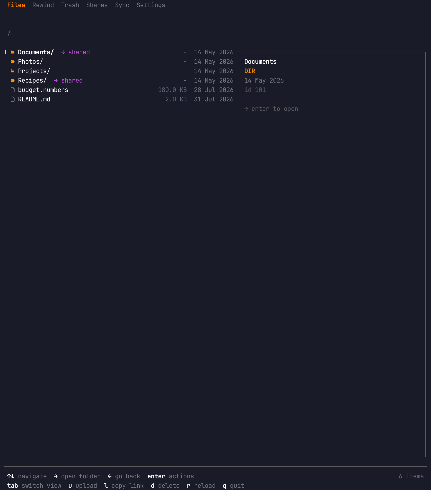
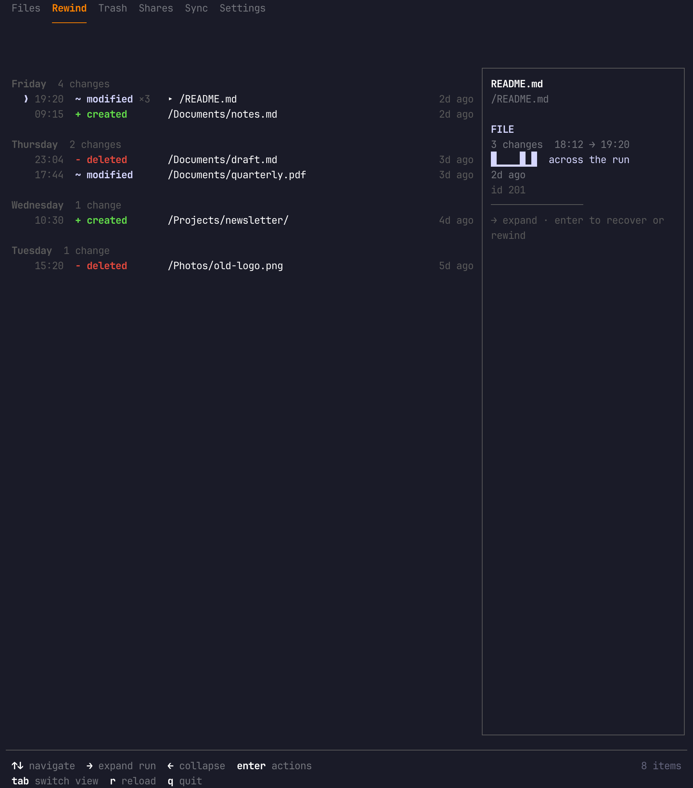
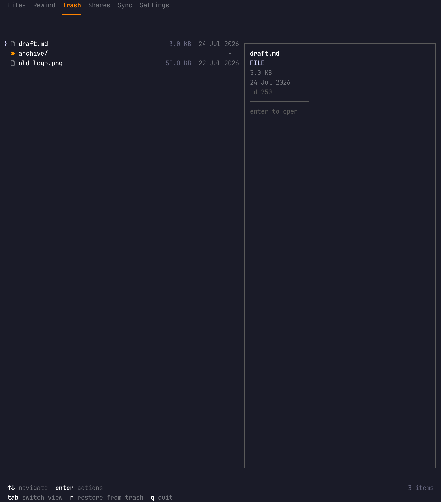
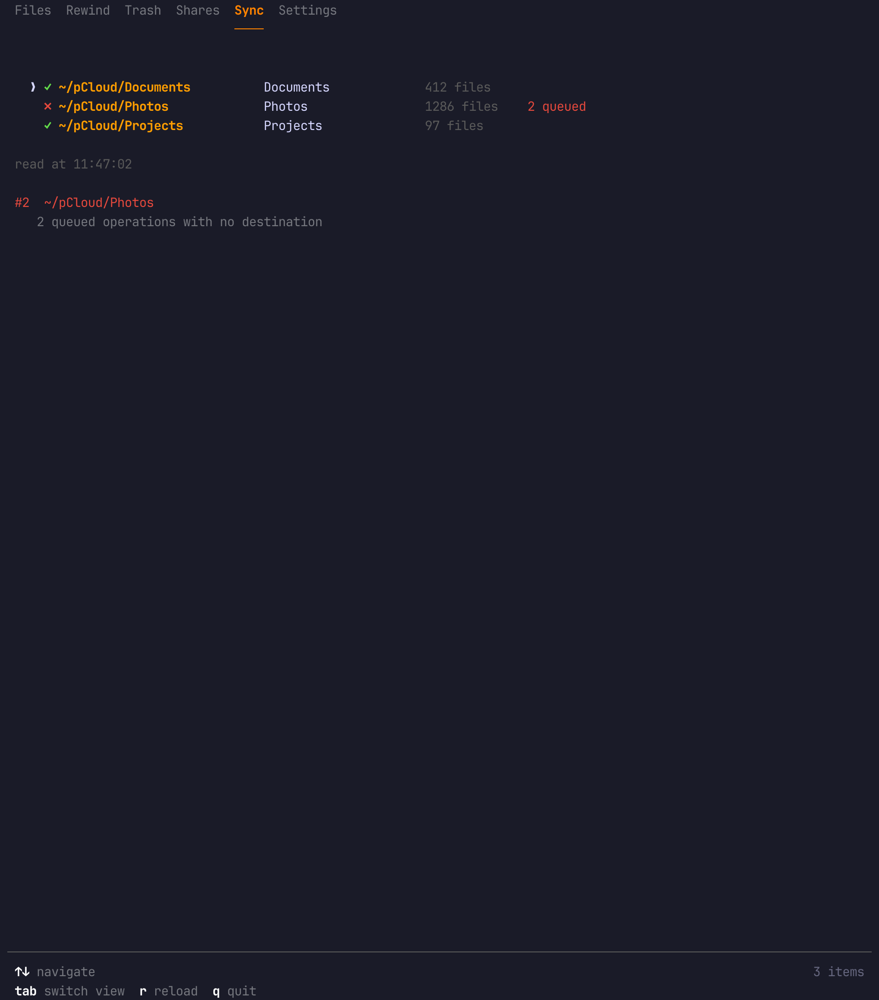
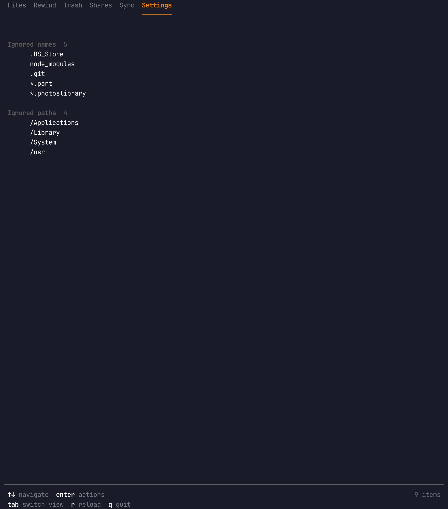

<div align="center">


**A pCloud client for the terminal — browse, rewind, share, and diagnose the sync daemon**

<a href="https://kud.io/projects/pcloud-cli">Website</a> · <a href="https://kud.io/projects/pcloud-cli/docs">Documentation</a>

</div>

## Features

- **A full-screen browser** — run `pcloud` with no arguments. Six tabs: files with inline image previews, change history, trash, shares, sync health and client settings.
- **Rewind** — undo a period rather than a file. `pcloud rewind --to "2026-07-30 20:30"` lists every restore and revert it would perform and does nothing until you add `--apply`. pCloud's own Rewind has no public API; this reconstructs it from the change log, the trash and per-file revisions.
- **Two ways to log in** — email and password by default, needing no setup and reaching the whole API; or `--oauth` for a browser flow that never handles your password.
- **Files, by path** — list, stat, copy, move, rename, upload, download and delete. Every command takes a path or an id, so nothing needs looking up first.
- **Revision history** — inspect every saved revision of a file and revert to any earlier version.
- **Trash and shares** — list and restore deletions; see what you have shared out and what has been shared with you, and revoke either.
- **Public links** — create, list and delete them, with optional expiry and download caps.
- **Local sync inspection** — read the pCloud Drive daemon's own database to find broken sync pairs, prune orphaned ones, and clear queued operations that can never complete. The desktop app reports these only as a bogus permissions error.
- **Client settings** — manage what pCloud Drive refuses to sync. These live in each machine's own database rather than your account, which is how a `node_modules` tree ends up in the cloud with no machine considering itself responsible for it.
- **`pcloud doctor`** — one command that says what is wrong and which command fixes it.

## Screenshots



<details>
<summary>Rewind, Trash, Sync and Settings</summary>

<br />

**Rewind** — the change log, grouped by day, with repeated edits to one file
collapsed into a single run.



**Trash** — what pCloud is still holding, and how long ago you deleted it.



**Sync** — every local pair, with the unhealthy one named and the reason spelled
out. The desktop app reports this as a permissions error.



**Settings** — what this machine refuses to sync. Per machine, not per account.



</details>

Every screenshot above is `pcloud --mock`: an invented account with invented
folders, shares and sync pairs. No credential required, and nothing touches the
network.

```sh
pcloud --mock
```

It exists because a folder listing says more about someone than they usually
intend, and the alternative is screenshotting a real drive.

## Install

```sh
npm install -g @kud/pcloud-cli
```

## Usage

```console
$ pcloud login
$ pcloud                          # the browser: Files · Rewind · Trash · Shares · Sync · Settings

$ pcloud whoami
Email:  you@example.com
Plan:   500
Quota:  12.4 GB / 500 GB (2.5% used)

$ pcloud ls /Photos
   dir   2024/                                   -           01 Jan 2024
   file  cover.jpg                               3.2 MB      14 May 2024

$ pcloud list-revisions /Photos/cover.jpg
   98765        latest    3.2 MB       14 May 2024 09:12
   91234                  3.1 MB       06 May 2024 18:40

$ pcloud revert-revision /Photos/cover.jpg 91234
✓ Done
```

Undo a period rather than a file — a dry run first, always:

```console
$ pcloud rewind --to "2026-07-30 20:30"
Rewinding to 30/07/2026, 20:30:00
Scanned 634 events.

Restore from trash (12):
  /Documents/quarterly.pdf
  /Documents/notes.md
  ...

Revert to an earlier version (41):
  /Reports/summary.tsv
  ...

This was a dry run. Re-run with --apply to perform it.
```

Diagnose the local daemon:

```console
$ pcloud doctor
pCloud doctor

  ✗ 1 problem found

  Sync        pair #1 · stuck
              → pcloud sync clear-tasks 1

  Credential  session token · 28 days left
  API         21 of 22 endpoints reachable
  Sync        5 pairs · daemon running
```

Manage what never syncs — per machine, not per account:

```console
$ pcloud settings ignore
   node_modules
   .git
   .DS_Store

$ pcloud settings ignore add "*.log"
   + *.log
Dry run. Re-run with --apply to write.
```

## Development

```sh
git clone https://github.com/kud/pcloud-cli.git
cd pcloud-cli
npm install
npm run dev -- ls /
npm test
```

Build compiled output to `dist/`:

```sh
npm run build
```

Built on [`@kud/pcloud`](https://github.com/kud/pcloud) for the API and rewind
engine, and [`@kud/pcloud-ink`](https://github.com/kud/pcloud-ink) for the
components — the same ones the browser and the one-shot commands both render.

📚 **Full documentation → [pcloud-cli/docs](https://kud.io/projects/pcloud-cli/docs)**
